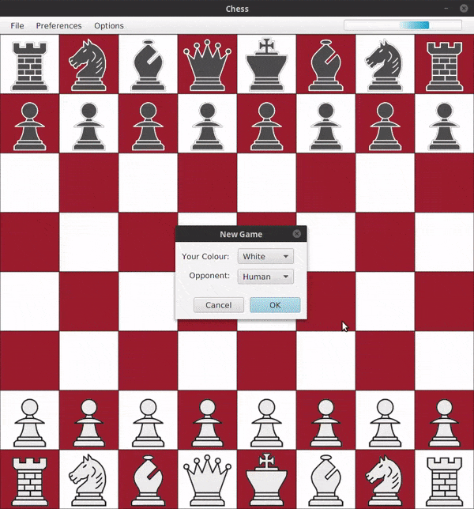

# Alpha Beta Chess Engine

This project showcases an AI implementation for chess, although it can also be used to play chess against your friends. The AI functions using the [alpha beta pruning algorithm](https://en.wikipedia.org/wiki/Alpha%E2%80%93beta_pruning) as a baseline, with many further improvements listed below.

## Getting Started
### Requirements

* Windows, Linux, or Mac OS
* Java version 8, 9 or 10 (11 is unsupported)

### Installation
The simplest way to get the program up and running is to double-click the [executable JAR file](out/artifacts/JustinDeCunha_ChessAI_jar/JustinDeCunha_ChessAI.jar), or calling it via command line:

`java -jar JustinDeCunha_ChessAI.jar`

More advanced users can also compile the program from the sources provided.

## Demo

## Features

### User Interface

The UI was made using JavaFX, and follows a typical MVC design pattern. The GUI interacts with a controller, which then modifies the engine's internal board representation.

### AI

#### Base

The heart of the AI is an alpha-beta algorithm variant called [negamax](https://en.wikipedia.org/wiki/Negamax), which relies upon the zero-sum property of a two player game, such as chess.

#### Move Ordering Heuristics

The alpha-beta algorithm greatly benefits from finding strong moves earlier in its search. By finding strong moves earlier, the search will prune unnecessary branches more aggressively, vastly reducing the size of the search tree, and hence greatly improving search speeds. For this reason, its worth using some sort of heuristic to ensure strong moves get searched first.

The moves are sorted based on a direct static evaluation function, which is used to estimate which moves are strongest based on piece positions and values. This move sorting improved search speeds of the algorithm by over 200%.

#### Transposition Tables

Because a particular board state can be reached through a variety of different move sequences, the search algorithm must repeatedly re-evaluate boards it has already seen, many many times. This can be optimized via dynamic programming. A transposition table is stored in RAM to quickly store and retrieve board evaluation results. Not only did this technique increase search speed by >500%, but it also directly improves engine strength, as it allows low-depth tree nodes to utilize more accurate information computed by high-depth tree nodes, that have already been stored inside the table.

## License

This project is licensed under the MIT License - see the [LICENSE.md](LICENCE.md) file for details.

## Acknowledgements

The majority of techniques utilized in this chess engine were discovered on the [chess programming wiki](https://chessprogramming.wikispaces.com/).

Piece graphics were taken from the PyChess repository, which can be found [here](https://github.com/pychess/pychess/tree/master/pieces).
